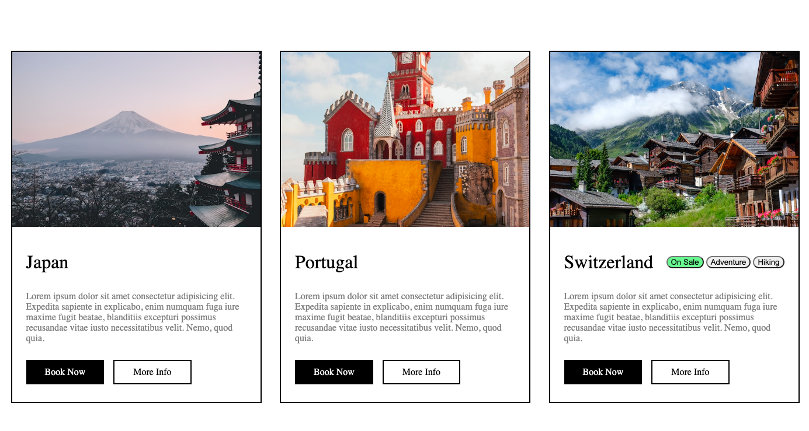

# SASS Travel Cards

## Description

This project was intended to demonstrate our learning of SCSS. I employed the industry standards of BEM naming and nesting of classes. It was not required to make it mobile-responsive.

